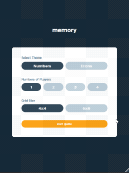
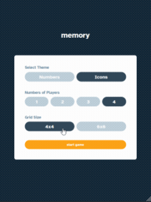

# Frontend Mentor: Memory Game App Challenge
 
## Welcome 🍃

This memory game was a cool project to put into practice my Responsive Design and also my `Javascript` skills.  

## Links
- My Linkedin [Linkedin](https://www.linkedin.com/in/mouhametndiaye/)
- My email ahmetndiaye404@gmail.com
- Live Project [Memory Game](https://mouhametnd-momory-game.netlify.app/)
- Challenged by [Frontend Mentor](https://www.frontendmentor)

## Challenge  

Your users should be able to:
- View the optimal layout for the game depending on their device's screen size
- See hover states for all interactive elements on the page
- Play the Memory game either solo or multiplayer (up to 4 players)
- Set the theme to use numbers or icons within the tiles
- Choose to play on either a 6x6 or 4x4 grid
- Can restart the game with the same settings or go back to the settings modal.

## Game Design

## Built with

- Mobile-first workflow
- Semantic HTML5 markup
- SASS
- Vanilla JavaScript

## What I learned
- JavaScript modules
- Manipulate elements through data-**attributes**

## How The Game Works
The game board consists of sixteen or Thirty-two "cards" arranged in a grid. The deck is made up of eight different pairs of cards, each with different symbols or numbers on one side. The cards are arranged randomly on the grid with the symbol face down. The gameplay rules are very simple: flip over two hidden cards at a time to locate the ones that match!

### Each turn:

- The player flips one card over to reveal its underlying symbol or number.
- The player then turns over a second card, trying to find the corresponding card with the same symbol or number.
- If the cards match, both cards stay flipped over.
- If the cards do not match, both cards are flipped face down.
- The game ends once all cards have been correctly matched.
